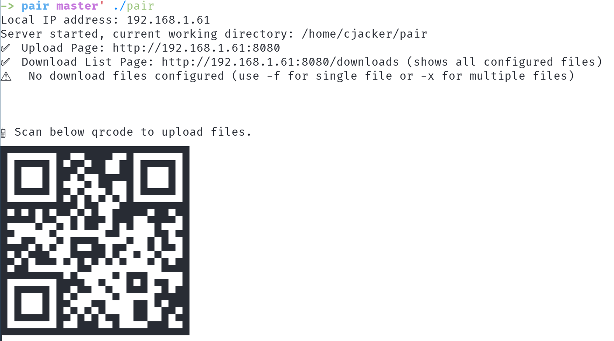
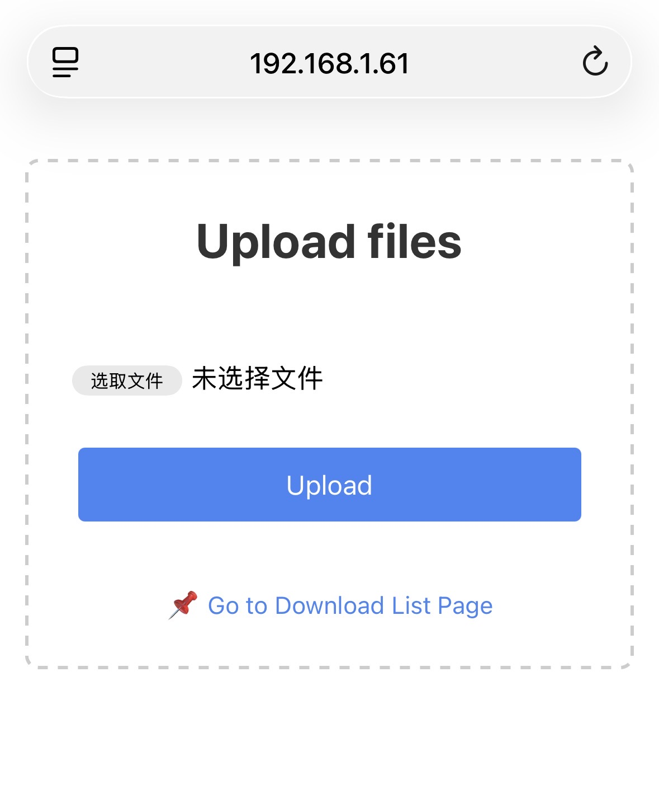

# pair
A lightweight command-line tool for **seamless file transfer** between PC and mobile devices via QR code scanning. No extra apps, no cloud services, just a local network connection — upload files from mobile to PC or download preconfigured files from PC to mobile with a single scan.

**NOTE: All codes and this README.md is generated by AI without any changes except this line:-)**

## Features
- 📱 **QR Code Access**: Instantly generate scannable QR codes for upload/download pages (no manual IP entry)
- ⬆️ **Mobile to PC Upload**: Upload files from your phone/tablet to the host PC via a responsive web interface (supports multiple files, progress bar)
- ⬇️ **PC to Mobile Download**: Preconfigure specific files on your PC for mobile download (single/multiple file support)
- 🌐 **Local Network Only**: Works entirely on your LAN — no internet, no data sharing with third parties
- 🚀 **Lightweight & Fast**: No heavy dependencies, minimal setup, blazingly fast file transfers
- ⚡ **No Mobile Apps**: Uses your device's native browser — no need to install extra software on mobile
- 🔒 **Path Restriction**: Strict file access control (only preconfigured files/directories are accessible)
- 📊 **Progress Tracking**: Real-time upload progress bar on the mobile web interface
- 🎯 **Cross-Platform**: Runs on Windows, macOS, and Linux (built with Go, single binary)

## Screenshot


## Installation
### Prerequisites
- Go 1.21+ (for building from source)
- A local network connection (PC and mobile must be on the **same Wi-Fi/LAN**)

### Install via `go install`
```bash
go install github.com/cjacker/pair@latest
```

### Build from Source
```bash
# Clone the repository
git clone https://github.com/cjacker/pair.git
cd pair

# Build the binary (single cross-platform binary)
go build -o pair main.go

# Add to PATH (optional, for global use)
# Linux/macOS
mv pair /usr/local/bin/
# Windows
move pair C:\Windows\System32\
```

## Quick Start
### Basic Usage (File Upload Only)
Run the tool with no arguments to start the upload server — a QR code will be generated for the upload page:
```bash
pair
```
1. Scan the QR code with your mobile device's camera/browser QR scanner
2. The mobile browser will open a responsive upload page
3. Select files on your mobile device and upload — files are saved directly to the **current working directory** on your PC

### Preconfigure Files for Download
Let mobile devices download specific files from your PC by preconfiguring them with flags:
#### Single File Download
```bash
# Allow mobile download of a single file (relative path)
pair -f documents/report.pdf
```
#### Multiple File Download
```bash
# Allow mobile download of multiple files (comma-separated, no spaces)
pair -x photos/vacation.jpg,docs/notes.txt,files/data.zip
```
- Scanning the QR code will open a download list page on mobile
- Only preconfigured files are accessible (strict path validation — no directory traversal)
- Files are served directly from your PC's local filesystem

### Show Help
```bash
pair -h
```

## Command-Line Flags
| Flag | Description | Example |
|------|-------------|---------|
| `-h` | Show help information and exit | `pair -h` |
| `-f` | Specify a **single file** for mobile download (relative path to current working directory) | `pair -f uploads/file.txt` |
| `-x` | Specify **multiple files** for mobile download (comma-separated, no spaces, relative paths) | `pair -x a.pdf,b.jpg,c.zip` |

## How It Works
1. **Local IP Detection**: `pair` automatically discovers your PC's local LAN IP address (no manual configuration)
2. **QR Code Generation**: Generates a scannable QR code for the relevant web page (upload page or download list page)
3. **Web Server**: Starts a lightweight HTTP server on port `8080` (default) with two core endpoints:
   - `/`: Responsive upload page (mobile → PC)
   - `/downloads`: Preconfigured file download list (PC → mobile)
   - `/download/[path]`: Direct file download endpoint (secure, path-restricted)
4. **File Transfer**: All transfers happen directly over your local network — maximum speed, no data limits

## Usage Scenarios
- 📸 Transfer photos/videos from your phone to your PC without cables/AirDrop
- 📄 Send documents from your PC to your tablet/phone for on-the-go access
- 💻 Share files between Windows/macOS/Linux PCs and iOS/Android devices
- 🚫 Avoid cloud storage for sensitive files (local transfer only)
- 🏠 Use at home/office with no internet connection required

## Security
- **Local Network Only**: No external internet access — all traffic stays on your LAN
- **Path Restriction**: Prevents directory traversal attacks (only the current working directory and preconfigured files are accessible)
- **No File Overwrites**: Uploaded files will not overwrite existing files on the PC (returns an error if the file exists)
- **Read-Only Download**: Mobile devices can only download preconfigured files — no write access to the PC's filesystem
- **No Persistent Storage**: The tool does not store any files/data beyond the current session

## Default Behavior
- Uploaded files are saved to the **current working directory** where `pair` is run
- HTTP server runs on port `8080` (fixed, no port conflict check — ensure port 8080 is free)
- QR code uses medium error correction (M) for reliable scanning
- Strict file access control — only preconfigured files are downloadable
- Multiple file upload support (mobile → PC) with progress tracking

## Troubleshooting
### QR Code Scanning Fails
1. Ensure your PC and mobile device are on the **same Wi-Fi/LAN**
2. Check that no firewall is blocking port `8080` on your PC
3. Verify the local IP address printed in the terminal is correct
4. Try scanning the QR code with a different browser/QR scanner (some camera apps have QR limitations)

### Upload/Download Fails
1. Confirm the local network connection (ping the PC's IP from mobile or vice versa)
2. Check that the PC's firewall allows inbound traffic on port `8080`
3. For downloads: Ensure the preconfigured file paths are **relative** and the files exist
4. For uploads: Ensure you have write permissions in the current working directory
5. Avoid special characters in file names (supported, but some older browsers may have issues)

### "No Local IP Found" Error
1. Ensure your PC is connected to a local network (Wi-Fi/Ethernet)
2. Restart the tool — it automatically re-discovers the network gateway/IP
3. For virtual machine users: Ensure the network adapter is set to **Bridged** (not NAT)

## License
This project is licensed under the **MIT License** — see the [LICENSE](LICENSE) file for details.

## Contributing
Contributions are welcome! Feel free to open issues for bugs/feature requests or submit pull requests for improvements. Key areas for contribution:
- Port customization (allow changing the default 8080 port)
- File overwrite confirmation for uploads
- Directory upload support (mobile → PC)
- Custom save directory for uploads
- QR code customization (size, error correction)
- Cross-platform binary releases (prebuilt Windows/macOS/Linux binaries)

## Acknowledgements
- [jackpal/gateway](https://github.com/jackpal/gateway): Local IP/gateway discovery
- [mdp/qrterminal](https://github.com/mdp/qrterminal): QR code generation in the terminal
- Go's standard library: Lightweight HTTP server, file I/O, and network utilities

---
Made with ❤️ for seamless local file transfer — no cables, no clouds, just pair.
